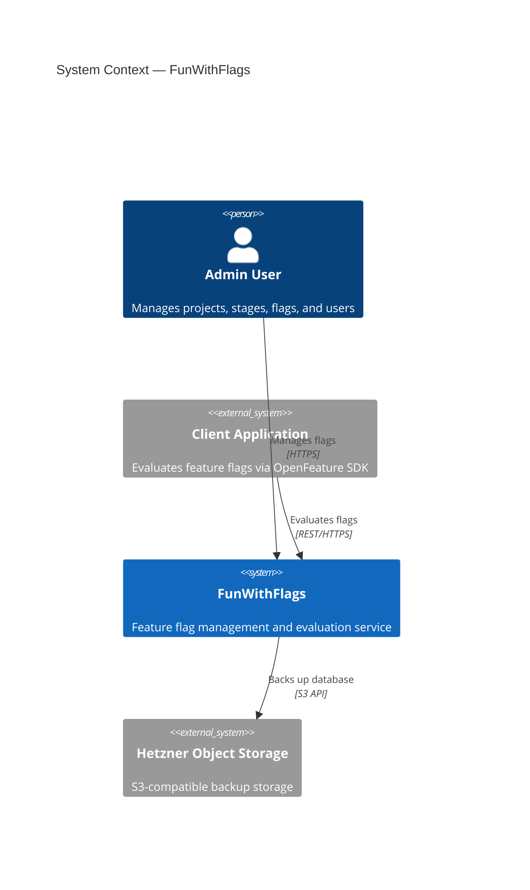
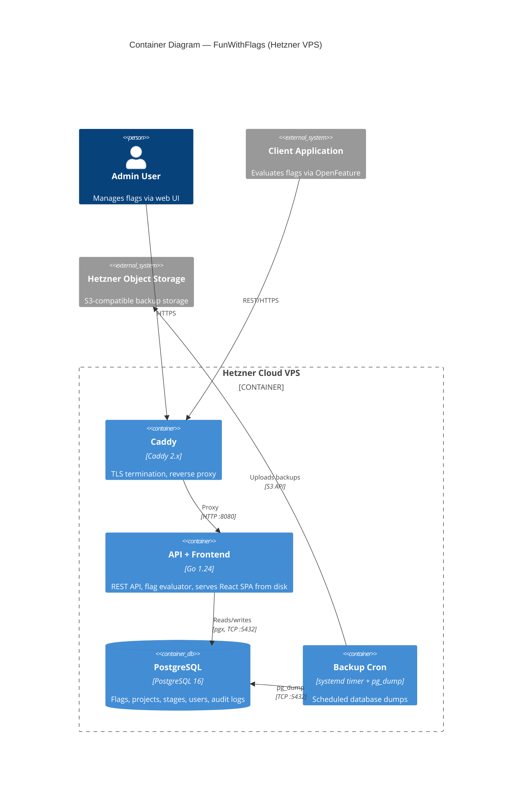

# FunWithFlags Architecture

## System Context (C4 Level 1)

High-level view of FunWithFlags and its interactions with users and external systems.

## Container Diagram (C4 Level 2)

Containers running on a single Hetzner Cloud VPS, managed by Podman + systemd.

## Container Summary

| Container | Technology | Responsibility |
|-----------|-----------|----------------|
| Caddy | Caddy 2.x (Podman) | TLS termination, reverse proxy to Go backend |
| API + Frontend | Go 1.24 (Podman) | REST API, flag evaluation engine, serves React SPA from disk |
| PostgreSQL | PostgreSQL 16 (Podman) | Persistent storage for flags, projects, stages, users, audit logs |
| Backup Cron | systemd timer + pg_dump | Scheduled database dumps to Hetzner Object Storage |

All Podman containers are managed by systemd with auto-update labels.
Containers communicate over a shared Podman network (`funwithflags`).
