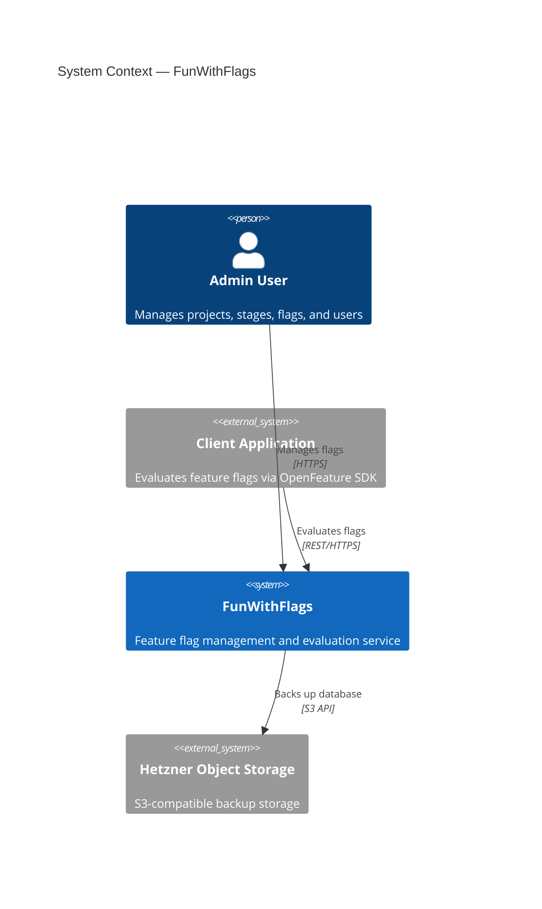
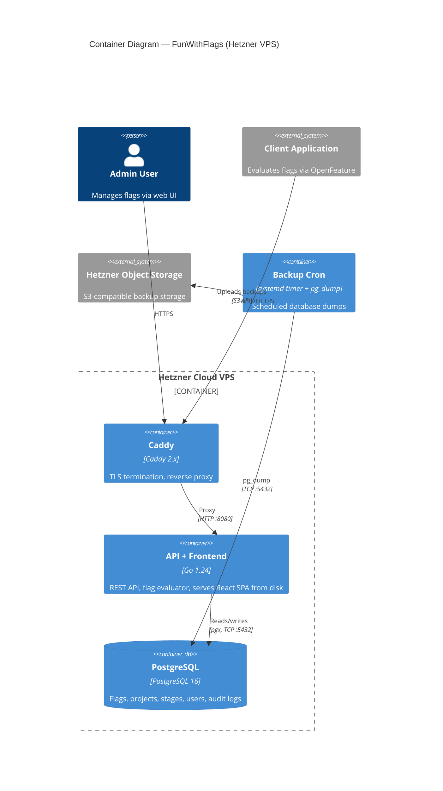

# FunWithFlags System Refinement — Design Spec

**Date:** 2026-03-12
**Status:** Draft
**Scope:** CLAUDE.md, C4 architecture diagrams, Hetzner deployment

## Overview

Three deliverables to formalize the funwithflags system for continued development and migration from Fly.io to Hetzner Cloud:

1. **CLAUDE.md** — AI assistant guidance, layered on top of existing AGENTS.md
2. **C4 Diagrams** — Mermaid-based Context (L1) and Container (L2) diagrams
3. **Hetzner Deployment** — Configs and docs replicating the jagderfolg pattern

## Decision Log

| Decision | Choice | Rationale |
|----------|--------|-----------|
| CLAUDE.md style | Layered (references AGENTS.md) | Avoids duplication, AGENTS.md covers conventions |
| C4 diagram format | Mermaid in Markdown | Version-controlled, renders on GitHub, easy to update |
| C4 depth | L1 Context + L2 Container | High-level, sufficient for the system's complexity |
| Hosting target | Hetzner Cloud VPS | Predictable pricing, proven pattern from jagderfolg |
| Container runtime | Podman + systemd auto-update | Matches existing jagderfolg infrastructure |
| Reverse proxy | Caddy | TLS termination, simple config, proven in jagderfolg |
| Database backups | pg_dump + Hetzner S3 | Proven pattern from jagderfolg |
| Frontend serving | Go backend serves static files from disk | Single container, no CORS, no Nginx needed |
| Podman networking | Shared Podman network | Containers reach each other by name |

---

## 1. CLAUDE.md

AI-specific guidance file. References AGENTS.md for build commands, coding style, and conventions. Focuses on what Claude needs to know about architecture, patterns, and constraints.

### Content Structure

```
# CLAUDE.md

## Role
Reference AGENTS.md for build/test commands, coding style, naming, and PR conventions.
This file covers architecture awareness and AI-specific guidance.

## Architecture Awareness
- Single Go binary serves REST API (/api/v1/*) and frontend static files (React SPA from disk)
- Entry point: cmd/server/main.go → internal/app/app.go wires all dependencies
- Repository pattern: interfaces in domain packages, implementations in same package (memory + postgres)
- Service layer wraps repositories with business logic
- HTTP handlers in internal/httpserver/, grouped by domain
- Frontend in frontend/ — built separately, copied into Go container image

## Key Domain Concepts
- Projects contain Stages; Flags are scoped to a Project+Stage pair
- Flags support temporal ranges: multiple validity windows with active/inactive state
- Flag evaluation: rules → target conditions → percentage rollouts → default variation
- Audit trail captures all flag changes with before/after JSONB values

## Patterns to Follow
- Repository pattern for any new storage concern (define interface, implement memory + postgres)
- Table-driven tests beside every package
- Composite keys for project/stage scoping
- HTTP handlers follow: parse request → call service → write JSON response
- Error types defined per package in errors.go
- Environment variables for all configuration (see internal/app/app.go)

## Things to Avoid
- Do not add an ORM — the project uses pgx directly, keep it that way
- Do not bypass or weaken auth middleware
- Do not add external HTTP client libraries — use net/http
- Do not add frontend dependencies without discussion (keep the SPA lightweight)
- Do not use embed.FS for frontend — files are served from disk at runtime
- Do not create Fly.io configs — deployment target is Hetzner/Podman

## Deployment Context
- Production: Hetzner Cloud VPS
- Containers: Podman with systemd units and auto-update
- Reverse proxy: Caddy (TLS termination)
- Database: PostgreSQL 16 in Podman container
- Backups: pg_dump to Hetzner Object Storage (S3-compatible)
- Local dev: docker-compose.yml (still uses Docker for convenience)

## Frontend
- React + Vite + TypeScript SPA in frontend/
- UI redesign planned separately (using Stitch)
- API calls go through frontend/src/api/client.ts (fetch wrapper with Bearer token)
- Auth state managed via React Context (AuthContext)
- Styling: CSS

## Notes
- Go version is 1.24 (per go.mod) — CI workflow (.github/workflows/ci.yml) still references 1.22
- AGENTS.md references Fly.io — will be updated as part of Hetzner migration
- CORS middleware may still be needed for external OpenFeature SDK clients, but SPA no longer needs it
- Repository interfaces live in different files per package (e.g., flag: model.go, project: repository.go)
```

---

## 2. C4 Architecture Diagrams

Mermaid-based diagrams in `docs/architecture.md`. Two diagrams: System Context (L1) and Container (L2).

### 2.1 System Context (L1)

Actors and external systems:

| Element | Type | Description |
|---------|------|-------------|
| Admin User | Person | Manages projects, stages, flags, and users via web UI |
| Client Application | External System | Evaluates feature flags via OpenFeature SDK / REST API |
| FunWithFlags | System | Feature flag management and evaluation service |
| Hetzner Object Storage | External System | S3-compatible backup storage for database dumps |

Relationships:
- Admin User → FunWithFlags: Manages flags (HTTPS)
- Client Application → FunWithFlags: Evaluates flags (REST/HTTPS)
- FunWithFlags → Hetzner Object Storage: Backs up database (S3 API)

### Mermaid Source



### 2.2 Container Diagram (L2)

Containers running on a single Hetzner Cloud VPS:

| Container | Technology | Responsibility |
|-----------|-----------|----------------|
| Caddy | Caddy 2.x (Podman) | TLS termination, reverse proxy to Go backend |
| API + Frontend | Go 1.24 (Podman) | REST API, flag evaluation engine, serves React SPA static files from disk |
| PostgreSQL | PostgreSQL 16 (Podman) | Persistent storage for flags, projects, stages, users, audit logs |
| Backup cron | systemd timer + pg_dump | Scheduled database dumps to Hetzner S3 |

All Podman containers managed by systemd with auto-update labels.

### Mermaid Source



---

## 3. Hetzner Deployment

Replicates the proven jagderfolg deployment pattern: Podman containers managed by systemd with auto-update, Caddy for TLS, PostgreSQL with S3 backups.

### 3.1 File Deliverables

| File | Purpose |
|------|---------|
| `deploy/Caddyfile` | Caddy reverse proxy config — proxies all traffic to Go backend on :8080 |
| `deploy/caddy.service` | systemd unit for Caddy Podman container |
| `deploy/funwithflags.service` | systemd unit for the app Podman container with auto-update label |
| `deploy/postgres.service` | systemd unit for PostgreSQL Podman container with persistent volume |
| `deploy/backup.sh` | Shell script: pg_dump → gzip → upload to Hetzner S3 with retention |
| `deploy/backup.service` | systemd unit invoked by backup.timer to run backup.sh |
| `deploy/backup.timer` | systemd timer for scheduled backup execution |
| `Dockerfile` | Multi-stage build: Node (SPA) + Go (binary) → single image (replaces existing) |
| `docs/hetzner-deployment.md` | Step-by-step deployment guide (replaces fly-deployment.md) |

**Obsoleted files:**
- `frontend/Dockerfile` — no longer needed, Go container serves frontend
- `frontend/fly.toml` — Fly.io config, superseded by Hetzner deployment
- `fly.toml` — Fly.io config, superseded by Hetzner deployment

### 3.2 Caddyfile

```
funwithflags.example.com {
    reverse_proxy localhost:8080
}
```

Caddy handles automatic HTTPS via Let's Encrypt. All traffic proxied to the Go backend which handles routing between API and static files.

### 3.3 Systemd Units

All containers on a shared Podman network (`funwithflags`) so they can reach each other by container name.

**caddy.service:**
- Podman container running Caddy 2.x
- Publishes ports 80 and 443 to host
- Mounts `deploy/Caddyfile` into container
- Depends on funwithflags.service

**funwithflags.service:**
- Podman container running the Go binary
- `io.containers.autoupdate=registry` label for auto-update
- Environment variables: `DATABASE_URL` (or `DB_HOST`, `DB_PORT`, `DB_USER`, `DB_PASSWORD`, `DB_NAME`, `DB_SSL_MODE`), `JWT_SECRET`, `PORT`, `STORAGE_TYPE`, `MIGRATIONS_PATH`, `CORS_ALLOWED_ORIGINS`, `AUTH_ADMIN_USERNAME`, `AUTH_ADMIN_PASSWORD`, `AUTH_USER_USERNAME`, `AUTH_USER_PASSWORD`, `FRONTEND_DIR`
- Depends on postgres.service
- Restart on failure

**postgres.service:**
- Podman container running PostgreSQL 16
- Named volume for data persistence
- Health check via pg_isready

**backup.service:**
- Oneshot unit invoked by backup.timer
- Runs `deploy/backup.sh`
- Environment variables: `S3_ENDPOINT`, `S3_BUCKET`, `S3_ACCESS_KEY`, `S3_SECRET_KEY`, `BACKUP_RETENTION_DAYS`

### 3.4 Backup Strategy

- systemd timer runs backup.sh on schedule (e.g., daily)
- backup.sh: `pg_dump` → gzip → upload to Hetzner Object Storage via S3 CLI
- Retention policy: configurable (e.g., keep last 30 days)
- Uses Hetzner S3-compatible endpoint

### 3.5 Dockerfile Changes

Replaces existing `Dockerfile` at repo root. Single multi-stage build:
1. **Node stage:** `npm ci && npm run build` in `frontend/` → produces `dist/`
2. **Go stage:** `go build` → produces binary
3. **Final stage:** Copy binary + `frontend/dist/` into minimal base image, Go serves static files from `/app/frontend/dist/`

### 3.6 Go Backend Changes (Required)

The Go backend does not currently serve static files. The following code changes are needed:

- **`internal/httpserver/router.go`** — Add a catch-all handler that serves files from a configurable directory, with SPA fallback to `index.html` for client-side routing
- **`internal/app/app.go`** — Add `FRONTEND_DIR` environment variable (e.g., `/app/frontend/dist/`); when set, enable the static file handler
- API routes (`/api/v1/*`) take precedence; unmatched paths fall through to the file server

### 3.7 docker-compose.yml Changes

Update for local dev to match the new architecture:
- Remove the separate `frontend` service
- The `app` service uses the new multi-stage Dockerfile (serves both API and SPA)
- Alternatively, keep `docker-compose.yml` for backend-only dev and use `npm run dev` separately with Vite proxy (current local dev workflow)

### 3.8 Deployment Guide Outline (docs/hetzner-deployment.md)

1. Provision Hetzner Cloud VPS (CX22 or similar)
2. Install Podman and enable lingering for the service user
3. Create shared Podman network (`funwithflags`)
4. Create Hetzner Object Storage bucket for backups
5. Install and configure Caddy (via Podman + systemd unit)
6. Copy systemd units, Caddyfile, and backup script to server
7. Configure environment variables (all vars listed in section 3.3)
8. Pull container images, start services (postgres → funwithflags → caddy)
9. Run initial database migration
10. Verify health checks
11. Set up podman auto-update timer
12. Configure backup timer and verify S3 upload

---

## Out of Scope

- UI redesign with Stitch (separate workstream)
- Kubernetes / k3s orchestration
- CI/CD pipeline changes (keep GitHub Actions as-is for now)
- Removing Fly.io configs (can be cleaned up later)
- Updating AGENTS.md to remove Fly.io references (do alongside migration)
- CI/CD Go version update (1.22 → 1.24)
